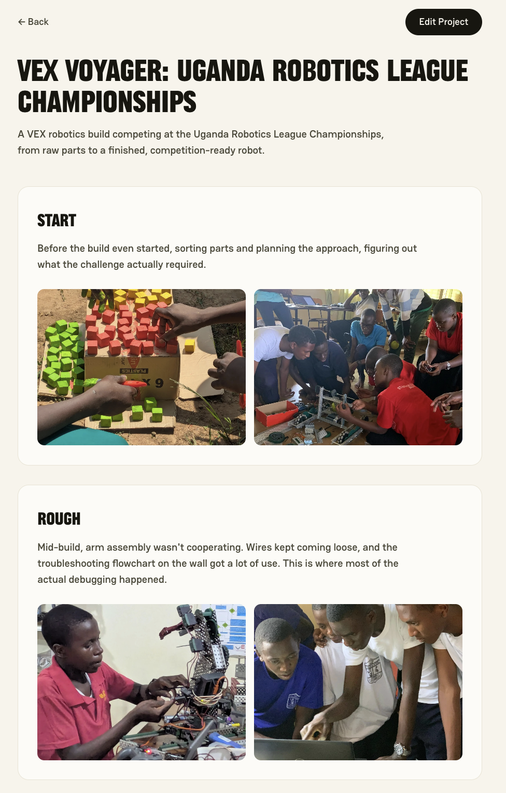
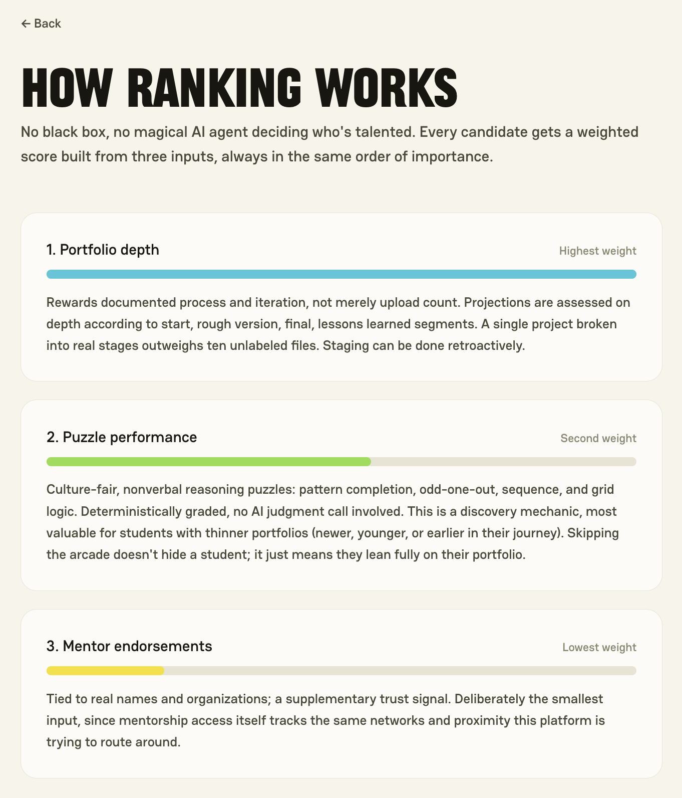
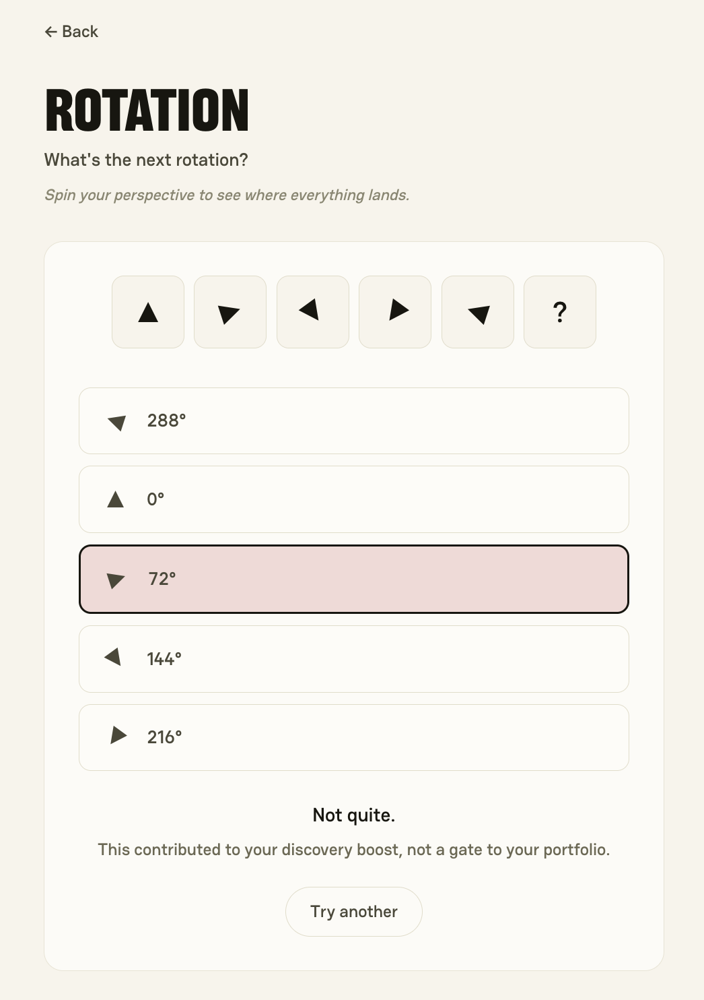
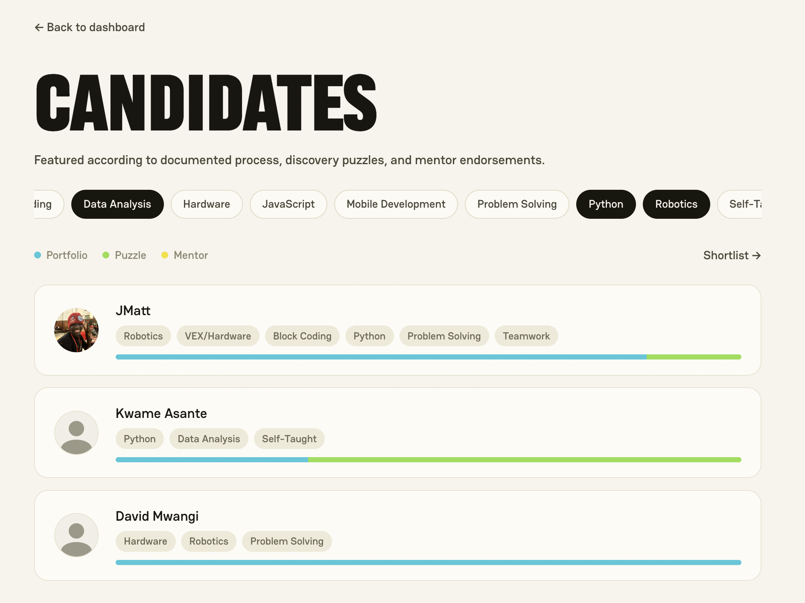

# Jayfound

**Demonstrated work, ranked fairly, found by the people who need it.**

Jayfound is a portfolio-first, credential-blind hiring discovery platform. It surfaces self-taught technical talent that recruiters would never find by resume, starting with one builder in Jinja, Uganda.

Built for Hack the North 2026.

**Live demo:** [jayfound.vercel.app](https://jayfound.vercel.app)

## Screenshots

<p align="center">
  
  
  
</p>

<p align="center">
  
</p>

<p align="center">
  <em>Portfolio Hub, how ranking works, and the puzzle arcade (top), and the recruiter view (bottom)</em>
</p>

## The problem

Hiring pipelines filter on degrees, resume polish, English fluency, and proximity to the right networks. They don't filter on whether someone can actually build. Talented self-taught builders get lost before anyone sees their work.

Our insight: **process is a better signal than pedigree, and it's verifiable.**

## What it does

### Portfolio Hub
Builders break any project down into stages: **start → rough version → final → lessons learned**. Projects can be staged retroactively, so something built years before the platform existed still counts. This captures reasoning and iteration, not just a finished artifact.

### Puzzle Arcade
An optional set of culture-fair, nonverbal reasoning puzzles (pattern completion, odd-one-out, sequences, grid logic), graded deterministically. Skipping it doesn't hide anyone. It just means their portfolio carries the full weight.

### Recruiter view
Recruiters browse a ranked list and filter by skill tag. They never filter by raw puzzle score.

## The ranking model

The ranking is the thesis of the project:

| Signal | Weight |
| --- | --- |
| Portfolio depth | Highest |
| Puzzle performance | Tiebreaker/discovery signal |
| Mentor endorsements | Lowest, supplementary |

The ranking is a plain server-side weighted calculation, recomputed on read. There is no ML model and no scoring service, by design. Puzzle scores can boost visibility but never outweigh demonstrated work.

## Tech stack

- **Next.js**: frontend and API routes in one repo and one language
- **Supabase**: Postgres database and file storage (video, code, and photo uploads)
- **Vercel**: hosting

A deliberately small stack with few moving parts, so the effort went into the portfolio staging UI and the ranking logic rather than infrastructure. There is no AI in this project; grading is deterministic.

## Running locally

Requirements: Node.js 18+ and a Supabase project.

```bash
git clone https://github.com/sarah-vanvelzer/jayfound.git
cd jayfound
npm install
cp .env.example .env.local
```

Fill in `.env.local` with your own Supabase project's URL and publishable key, then:

```bash
npm run dev
```

Open [http://localhost:3000](http://localhost:3000).

### Environment variables

| Variable | Description |
| --- | --- |
| `NEXT_PUBLIC_SUPABASE_URL` | Your Supabase project URL, e.g. `https://<project-ref>.supabase.co` |
| `NEXT_PUBLIC_SUPABASE_ANON_KEY` | Your Supabase publishable key (starts with `sb_publishable_`) |

## Scope

This is a hackathon prototype, built solo. Auth, payments, and mentor verification were left out deliberately so the core ideas (staged portfolios and the ranking model) could be built well.

## What's next

- AI-assisted grading for open-ended reasoning tasks
- Anti-cheating and proctoring as usage scales
- Multi-language support
- Expansion beyond Jinja to other resource-constrained maker communities
- A cold-start pilot: a named cohort from the Jinja hackerspace and coaches, an anchor recruiter reviewing the first ranked list, and mentor endorsements tied to real, verifiable names and organizations
